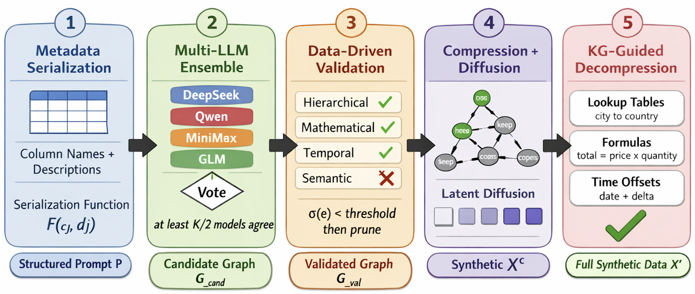
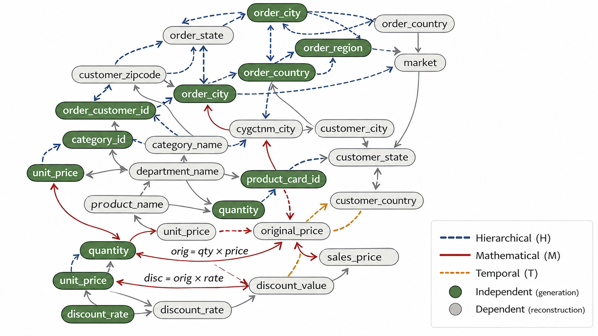

# TabKG

**Generating Logically Consistent Synthetic Supply Chain Data with LLM-Driven Knowledge Graph Reasoning**

<p align="center">
  
</p>

<p align="center"><em>Overview of the TabKG framework. Stage 1 serializes column metadata. Stage 2 constructs a candidate knowledge graph via a multi-LLM ensemble with majority voting. Stage 3 validates each edge against real data and prunes hallucinated relationships. Stage 4 uses the validated graph for compression and latent diffusion-based generation. Stage 5 reconstructs the full synthetic dataset via knowledge graph-guided decompression.</em></p>

<p align="center">
  
</p>

<p align="center"><em>Example validated CR-KG learned by TabKG on a supply chain schema. Edge types are colour-coded: hierarchical (blue), mathematical (red), and temporal (orange). Green nodes are independent columns generated by the latent diffusion model; grey nodes are dependent columns deterministically reconstructed from the validated relationships.</em></p>

---

Official implementation of **TabKG**, a knowledge-graph-guided framework for logically consistent synthetic supply chain tabular data generation. TabKG explicitly constructs a *Column Relationship Knowledge Graph (CR-KG)* over a table's columns, validates each candidate relationship against real data, and uses the validated CR-KG to guide a compression-and-reconstruction generation pipeline so that operational logic — hierarchical taxonomies, mathematical formulas, temporal orderings, and conditional rules — is enforced **by construction** in the generated data.

> Yunbo Long, Liming Xu, Alexandra Brintrup. *Generating Logically Consistent Synthetic Supply Chain Data with LLM-Driven Knowledge Graph Reasoning.* International Journal of Production Research (under review), 2026.

---

## Overview

Existing tabular generative models (CTGAN, TabDDPM, TabSyn, GReaT, …) are primarily optimised for distributional fidelity and downstream predictive utility. They often produce records that look statistically realistic but violate basic process logic — cities mapped to the wrong country, delivery dates before order dates, or totals that do not equal price × quantity. For supply chain simulation and operational decision support, this is unacceptable.

TabKG addresses this gap with a five-stage pipeline:

1. **Metadata serialization** — serialize column names and descriptions of the target table.
2. **Multi-LLM ensemble graph construction** — query several LLMs in parallel; each proposes a typed, directed graph over columns. Edges supported by a majority of models are kept.
3. **Data-driven validation** — every candidate edge is checked against the real data using a type-specific validator (functional dependency, formula evaluation, temporal ordering, conditional rule). Edges below a configurable threshold are pruned as hallucinations.
4. **CR-KG-guided compression and latent diffusion generation** — the validated CR-KG induces a DAG over columns. Root (independent) columns are generated by a latent diffusion model; dependent columns are dropped from the generative target.
5. **Knowledge-graph-guided decompression** — dependent columns are reconstructed deterministically from the validated rules, so all discovered logical relationships hold exactly in the synthetic data.

## Edge types

| Type | Meaning | Validator |
|---|---|---|
| `hierarchical` | functional dependency (e.g., `city → state → country`) | one unique target value per source group |
| `mathematical` | formula-based derivation (e.g., `total = price * quantity`) | evaluate RHS on real columns; compare to LHS |
| `temporal`     | source datetime precedes target datetime | satisfaction rate of `source ≤ target` |
| `semantic`     | conditional rule (`IF cond THEN constraint`) | satisfaction of constraint within the condition subset |

## Repository structure

```
TabKG/
├── main.py                       # Entry point: legacy 3-prompt pipeline OR CR-KG pipeline
├── config.py                     # API-key loader + per-dataset column descriptions
├── api_clients.py                # Legacy 3-prompt LLM client implementations
├── data_processing.py            # Compression / restoration utilities for the legacy pipeline
├── reasoning/                    # CR-KG pipeline modules
│   ├── prompts.py                #   structured prompt for graph construction
│   ├── llm_ensemble.py           #   stage 2: multi-LLM ensemble + majority voting
│   ├── graph_validator.py        #   stage 3: data-driven edge validation
│   └── graph_compressor.py       #   stage 4: DAG construction + compression plan
├── experiments/
│   └── run_reasoning.py          # F1 evaluation against ground-truth relationships
├── data/                         # CSV inputs (one file per dataset)
├── results/                      # Outputs (auto-created, gitignored)
└── requirements.txt
```

## Installation

```bash
git clone https://github.com/Yunbo-max/TabKG.git
cd TabKG
pip install -r requirements.txt
```

Python 3.10+ is required.

## Configuration

API keys are read from a `.env` file at the repo root:

```bash
OPENAI_API_KEY=...
DEEPSEEK_API_KEY=...
ANTHROPIC_API_KEY=...
TOGETHER_API_KEY=...          # for Llama via Together.ai
SILICONFLOW_API_KEY=...       # for Qwen / MiniMax / GLM
```

Column descriptions for each dataset live in `config.py::get_column_descriptions`. The repository ships with metadata for the two industrial supply chain datasets used in the paper:

* **Retail** — public DataCo supply chain dataset (`dataco`), used for *late-delivery risk prediction* (≈150 K samples, 41 features).
* **Purchasing** — proprietary procurement dataset, used for *procurement-status classification* (21 features).

Two additional benchmark datasets (`adult`, `icustays`) are kept for cross-domain ablation.

## Usage

### CR-KG pipeline (the TabKG method)

Single LLM:

```bash
python main.py --method crkg --data dataco --model deepseek
```

Cross-model ensemble with majority voting (paper's main setting):

```bash
python main.py --method crkg --data dataco \
  --ensemble "deepseek,qwen,minimax" \
  --validation_threshold 0.90
```

Same-model temperature sweep (robustness ablation):

```bash
python main.py --method crkg --data dataco \
  --ensemble "deepseek,deepseek,deepseek,deepseek,deepseek" \
  --temp_range "0.1,0.2,0.3,0.4,0.5"
```

Outputs land in `results/{data}/`:

* `CRKG_FilteredOutput.csv` — table with dependent columns dropped (input for the latent diffusion generator).
* `CRKG_graph.json` — candidate graph, validated graph, pruned edges, validation scores, and compression plan.

### Reasoning-only evaluation (F1 vs. ground-truth relationships)

```bash
python experiments/run_reasoning.py --model deepseek
python experiments/run_reasoning.py --model deepseek --temp_sweep
```

### Legacy 3-prompt baseline

The original three-prompt approach (no graph construction) is retained for comparison with the CR-KG ensemble:

```bash
python main.py --method legacy --data dataco --model deepseek
```

## Key CLI flags

| Flag | Description | Default |
|---|---|---|
| `--method` | `legacy` (3-prompt) or `crkg` (CR-KG) | `legacy` |
| `--data` | dataset name (`dataco`, `purchasing`, `adult`, `icustays`) | `icustays` |
| `--model` | single LLM if `--ensemble` not set | `deepseek` |
| `--ensemble` | comma-separated model list for majority voting | `None` |
| `--temp_range` | comma-separated temperatures for same-model voting | `None` |
| `--validation_threshold` | minimum validation score to keep a CR-KG edge | `0.90` |
| `--temp` | LLM sampling temperature | `0.1` |
| `--max_tok` | maximum tokens in LLM response | `2000` |

## Results highlights

Across two industrial supply chain datasets and two downstream classification tasks:

* TabKG achieves an F1 score of up to **0.97** for operational logic discovery, vs. **0.37–0.55** for prompt-only baselines (single-LLM, no validation).
* TabKG matches CTGAN / TabDDPM / TabSyn / GReaT on fidelity, utility, and privacy, while **substantially improving logical consistency**.

See the paper for full tables on F1, fidelity, machine-learning efficacy, MLE, and privacy.

## Related work

This work is part of a line of research on preserving and evaluating inter-column logical relationships in synthetic tabular data:

* **[LLM-TabLogic](https://arxiv.org/abs/2503.02161)** ([arXiv:2503.02161](https://arxiv.org/abs/2503.02161)) — the precursor that first introduces preserving inter-column logical relationships via prompt-guided latent diffusion.
* **[TabLogicEval](https://github.com/Yunbo-max/TabLogicEval)** — the companion *metrics* paper, 🎉 **accepted at the [ICLR 2025 Tiny Papers Track](https://iclr.cc/Conferences/2025).** It proposes HCS / MDI / DSI for evaluating inter-column logical preservation; TabKG addresses the gaps these metrics expose.
* **TabKG** (this repo) — the refined journal version that makes the operational logic explicit as a validated Column Relationship Knowledge Graph and enforces it by construction.

## Citation

```bibtex
@article{long2026tabkg,
  title   = {Generating Logically Consistent Synthetic Supply Chain Data with LLM-Driven Knowledge Graph Reasoning},
  author  = {Long, Yunbo and Xu, Liming and Brintrup, Alexandra},
  journal = {International Journal of Production Research},
  year    = {2026}
}

@inproceedings{long2025logicaltabular,
  title     = {Evaluating Inter-Column Logical Relationships in Synthetic Tabular Data Generation},
  author    = {Long, Yunbo and Xu, Liming and Brintrup, Alexandra},
  booktitle = {ICLR 2025 Tiny Papers Track},
  year      = {2025}
}

@misc{long2025llmtablogicpreservingintercolumnlogical,
  title         = {LLM-TabLogic: Preserving Inter-Column Logical Relationships in Synthetic Tabular Data via Prompt-Guided Latent Diffusion},
  author        = {Yunbo Long and Liming Xu and Alexandra Brintrup},
  year          = {2025},
  eprint        = {2503.02161},
  archivePrefix = {arXiv},
  primaryClass  = {cs.LG},
  url           = {https://arxiv.org/abs/2503.02161}
}
```

## License

MIT — see [LICENSE](LICENSE).
